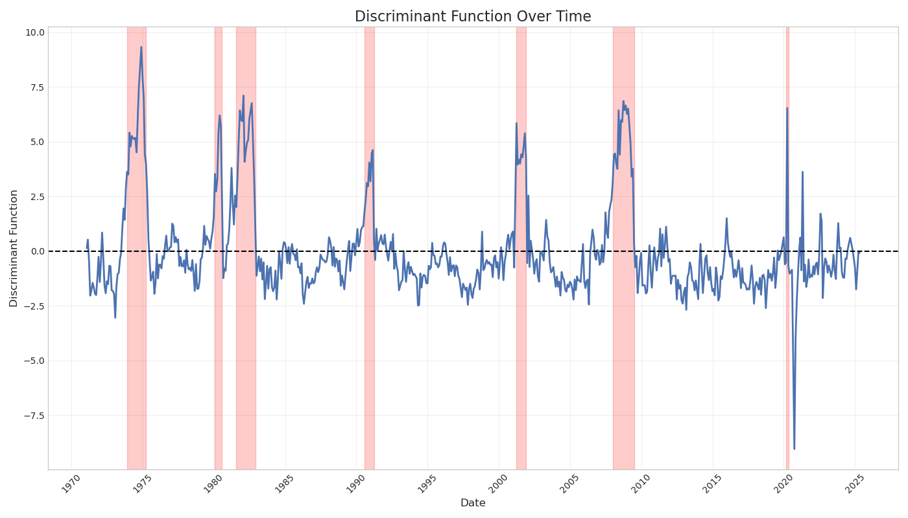

# Economic Downturn Detector

## Predicting Recession: A Multiple Discriminant Analysis of Economic Indicators

### Project Overview
This project aims to develop a predictive model to identify potential recessions by analyzing key economic indicators using Multiple Discriminant Analysis (MDA). Recognizing the profound impact recessions have on societies and economies, early detection is crucial for policymakers, businesses, and individuals to make informed decisions.

### Research Questions
- Which economic indicators are most significant in predicting recessions?
- How effectively can MDA classify periods as recessionary or non-recessionary based on these indicators?

### Team Members
- Avery Cloutier
- Matthew Grohotolski
- Sruthi Rayasam

### Datasets
- **Primary**: Federal Reserve Economic Data (FRED) repository
- **Secondary**:
  - National Bureau of Economic Research (NBER) business cycle data
  - University of Michigan's Surveys of Consumers
  - Unemployment Rate data

Our analysis covers economic data from **January 1970 to April 2025**, including historical data through May 2024 and forward-looking projections for key indicators. This timeframe encompasses 8 recession periods and multiple economic cycles.

### Key Findings

#### Most Significant Predictors of Recessions
Based on our Multiple Discriminant Analysis, the most important economic indicators for predicting recessions are:

1. **Rate of Change in Consumer Price Index (CPI)**: The 1-month percentage change in CPI is the strongest predictor, suggesting that sudden changes in inflation are closely tied to economic downturns.

2. **GDP Growth Rate**: The 12-month percentage change in GDP is a powerful predictor, confirming that sustained economic growth or contraction over a year is a key recession indicator.

3. **Industrial Production Changes**: Both short-term (1-month) and long-term (12-month) changes in industrial production are strong predictors, highlighting the importance of manufacturing activity in economic cycles.

4. **Retail Sales Growth**: Changes in retail sales over various time horizons (1, 3, and 12 months) are significant predictors, reflecting the importance of consumer spending in the economy.

#### Model Performance
Our MDA model achieved impressive results:

- **Accuracy**: 95.9% accuracy in classifying periods as recessionary or non-recessionary
- **Precision for Recession Detection**: 79% (meaning 79% of predicted recessions were actual recessions)
- **Recall for Recession Detection**: 86% (meaning the model correctly identified 86% of actual recessions)
- **Cross-Validation Score**: 95.5% average accuracy across 5-fold cross-validation

These results demonstrate that our model is highly effective at distinguishing between recessionary and non-recessionary periods based on economic indicators.

### Methodology
Our analytical approach encompassed:

1. **Data Collection**: Gathering economic indicators from FRED and recession dates from NBER
2. **Feature Engineering**: Creating lag variables and rate-of-change features to capture leading indicators
3. **Multiple Discriminant Analysis**: Identifying linear combinations of economic indicators that best differentiate between recessionary and non-recessionary periods
4. **Model Evaluation**: Assessing model performance using metrics such as classification accuracy, sensitivity, specificity, and confusion matrices
5. **Cross-Validation**: Implementing k-fold cross-validation to ensure the model's robustness and generalizability

### Repository Structure
- `data/`: Raw and processed datasets
  - `fred/`: Federal Reserve Economic Data
  - `nber/`: National Bureau of Economic Research data
  - `umich/`: University of Michigan Consumer Sentiment data
  - `processed/`: Processed datasets for analysis
- `notebooks/`: Jupyter notebooks for analysis
  - `01_data_exploration.ipynb`: Data exploration and visualization
  - `02_feature_engineering.ipynb`: Feature engineering and preprocessing
  - `03_multiple_discriminant_analysis.ipynb`: MDA modeling and evaluation
- `src/`: Python modules and scripts
  - `fetch_fred_data.py`: Script to fetch data from FRED API
  - `fetch_nber_data.py`: Script to fetch NBER recession data
  - `fetch_umich_data.py`: Script to fetch UMich Consumer Sentiment data
- `docs/`: Project documentation
  - `installation.md`: Setup instructions
  - `data_dictionary.md`: Description of datasets and variables
  - `project_proposal.md`: Original project proposal
  - `visualizations.md`: Guide to all visualization outputs

### Getting Started
See the [Installation Guide](docs/installation.md) for setup instructions.

**Note:** This project requires a FRED API key to fetch economic data. You'll need to create an account on [FRED (Federal Reserve Economic Data)](https://fred.stlouisfed.org/), request an API key from your account settings, and add it to a `.env` file in the project root. See the installation guide for detailed instructions.

### Visualizations

#### Discriminant Function Over Time

This plot shows the discriminant function value over time, with recession periods shaded in red. Values above zero indicate a higher probability of recession. Note how the function rises significantly before each recession, demonstrating the model's predictive power.

#### Feature Importances

This plot shows the relative importance of different economic indicators in predicting recessions. The height of each bar represents the importance of that feature in the MDA model.

For a comprehensive guide to all visualizations produced by this project, see the [Visualizations Guide](docs/visualizations.md).

### Conclusion
Our Multiple Discriminant Analysis model successfully identifies the most significant economic indicators for predicting recessions and achieves high accuracy in classifying economic periods. The results suggest that monitoring changes in CPI, GDP growth rates, industrial production, and retail sales can provide early warnings of potential economic downturns.

Future work could focus on developing a real-time monitoring system for these key indicators and creating a recession probability index based on the discriminant function.