# Visualizations Guide

This document provides a comprehensive overview of the visualizations generated by the Economic Downturn Detector project. These visualizations help in understanding economic indicators, their relationships with recessions, and the performance of the Multiple Discriminant Analysis (MDA) model.

## Economic Indicators

### Individual Indicators with Recession Periods

These visualizations show the historical values of key economic indicators with recession periods highlighted in gray.

#### GDP Over Time
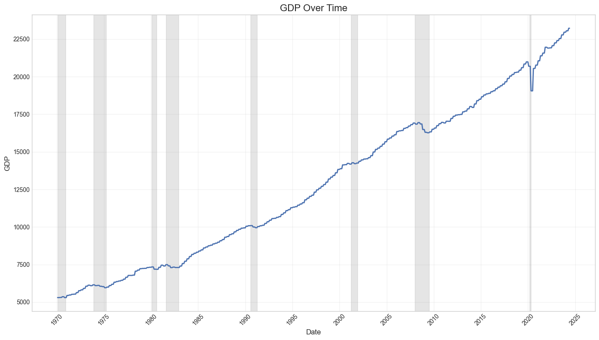

**Description**: This visualization shows the Gross Domestic Product (GDP) over time, with recession periods highlighted. GDP is a key indicator of economic health, and typically declines during recessions.

**Interpretation**:
- Upward trends indicate economic growth
- Downward trends or plateaus often precede or coincide with recessions
- The gray shaded areas represent official recession periods as defined by NBER

#### Unemployment Rate Over Time
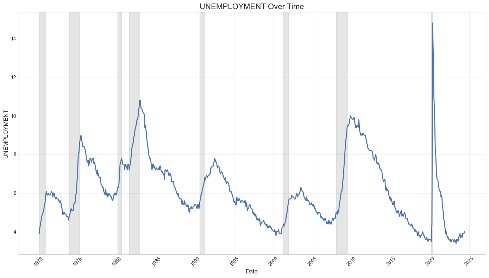

**Description**: This visualization shows the unemployment rate over time, with recession periods highlighted. Unemployment typically rises during recessions.

**Interpretation**:
- Sharp increases in unemployment often occur during recessions
- Unemployment tends to lag behind other indicators, often continuing to rise even after a recession has technically ended
- Pre-recession periods often show low and stable unemployment

#### Consumer Price Index (CPI) Over Time
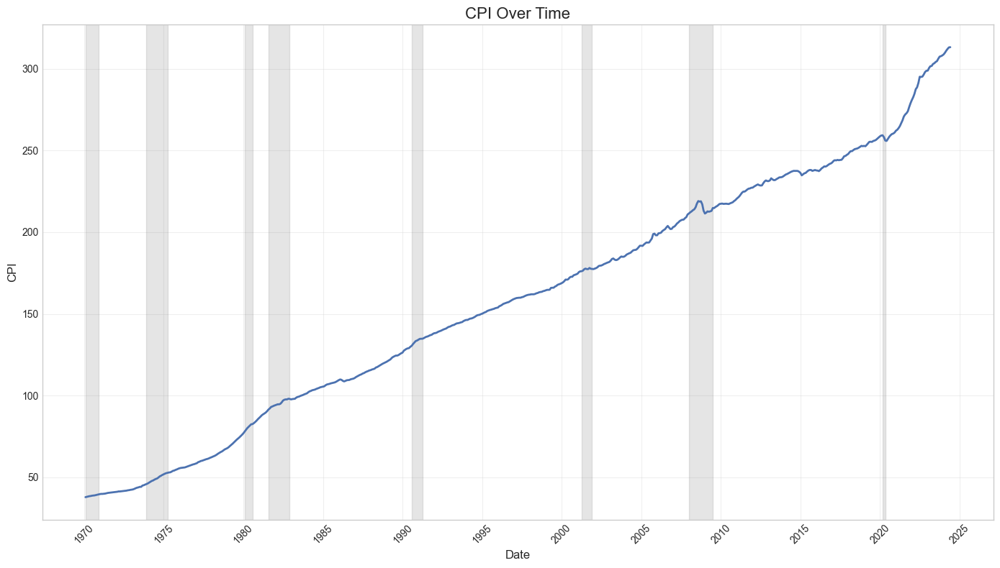

**Description**: This visualization shows the Consumer Price Index (CPI) over time, which measures inflation.

**Interpretation**:
- Steady upward trend reflects normal inflation
- Rapid increases indicate high inflation periods
- Changes in the slope can indicate shifts in economic conditions

#### Federal Funds Rate Over Time
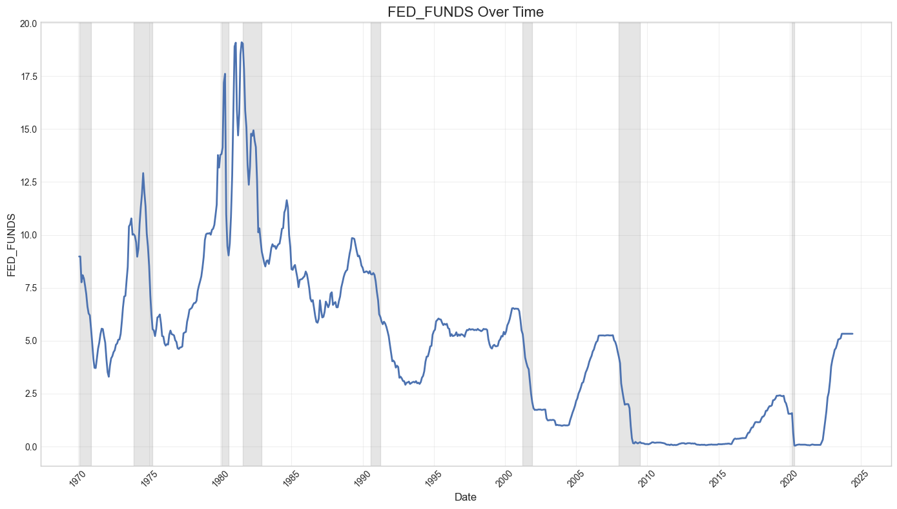

**Description**: This visualization shows the Federal Funds Rate over time, which is the interest rate set by the Federal Reserve.

**Interpretation**:
- Rate increases typically indicate attempts to cool an overheating economy or combat inflation
- Rate decreases often occur in response to economic slowdowns
- Sharp decreases often occur at the onset of recessions

## Consumer Sentiment Analysis

### Consumer Sentiment Over Time
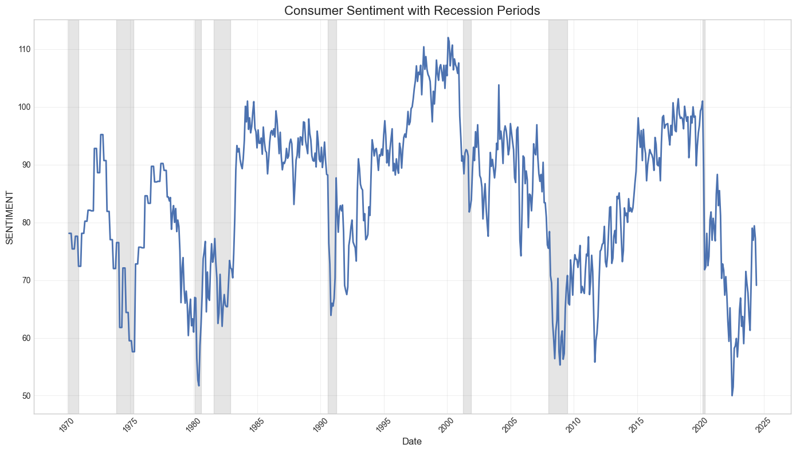

**Description**: This visualization shows consumer sentiment over time, with recession periods highlighted.

**Interpretation**:
- Declining consumer sentiment often precedes recessions
- Sharp drops in sentiment can be early warning signs of economic downturns
- Recovery in sentiment may lag behind economic recovery

### Consumer Sentiment vs. Economic Indicators

#### Sentiment vs. GDP
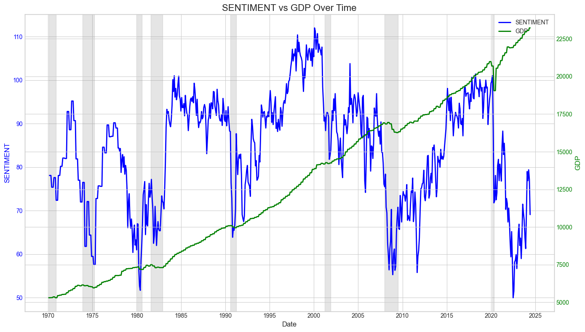

**Description**: This visualization compares consumer sentiment with GDP over time.

**Interpretation**:
- Shows how consumer perception (sentiment) relates to actual economic output (GDP)
- Divergences between the two can indicate potential future economic shifts
- Sentiment often declines before GDP during pre-recession periods

#### Sentiment vs. Unemployment
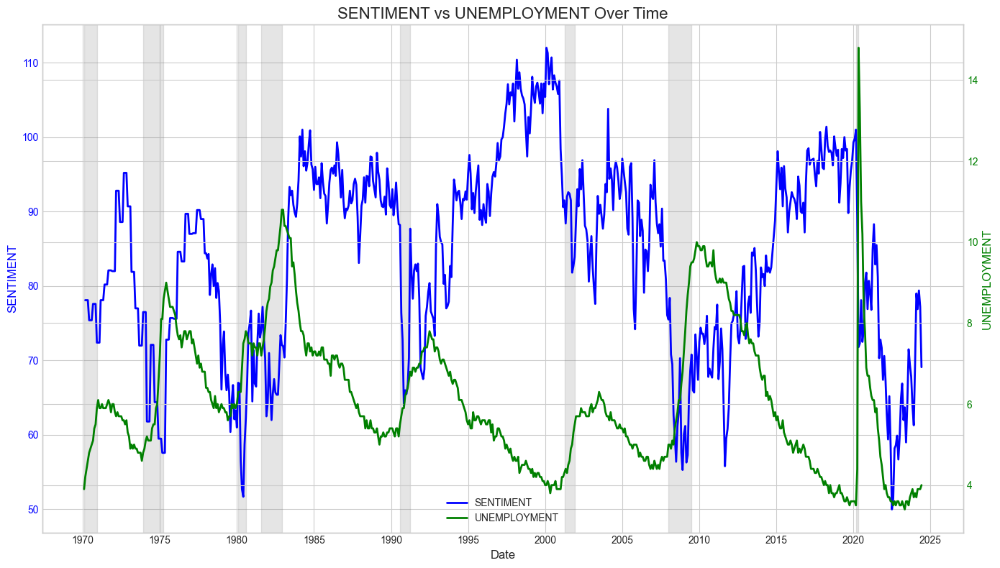

**Description**: This visualization compares consumer sentiment with the unemployment rate over time.

**Interpretation**:
- Inverse relationship is typically observed (sentiment falls as unemployment rises)
- Sentiment may respond more quickly to economic conditions than the unemployment rate
- Can help identify when sentiment is disproportionately affected by labor market conditions

## Correlation Analysis

### Correlation Matrix
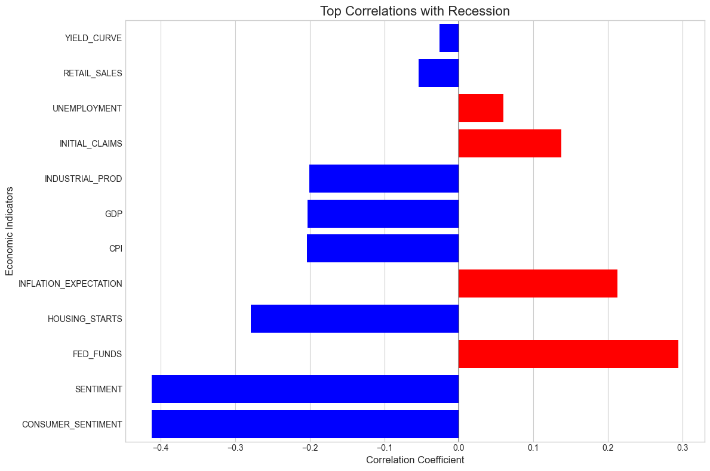

**Description**: This visualization shows the correlation between different economic indicators and recession periods.

**Interpretation**:
- Positive values (red) indicate indicators that tend to increase during recessions
- Negative values (blue) indicate indicators that tend to decrease during recessions
- The magnitude indicates the strength of the relationship

### Sentiment Correlations
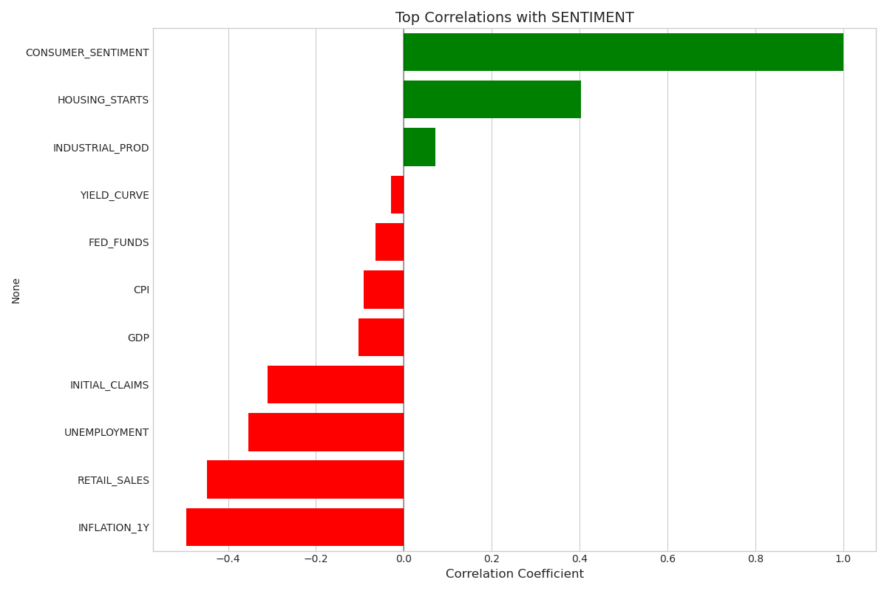

**Description**: This visualization shows the correlation between consumer sentiment and various economic indicators.

**Interpretation**:
- Shows which economic indicators are most strongly related to consumer sentiment
- Positive correlations indicate indicators that move in the same direction as sentiment
- Negative correlations indicate indicators that move in the opposite direction

## Model Analysis

### Feature Importance
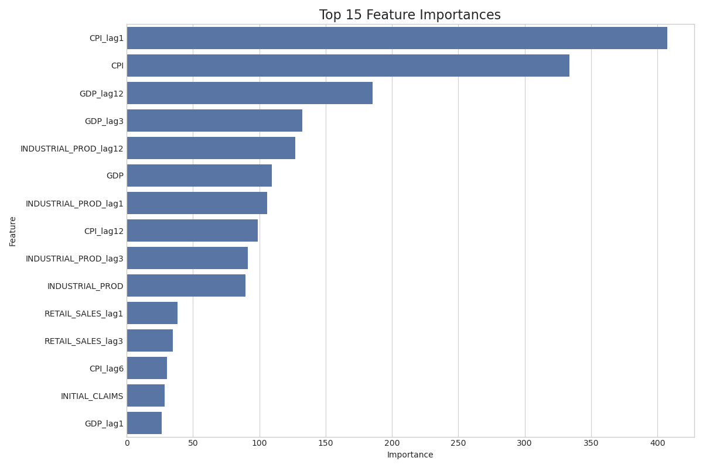

**Description**: This visualization shows the importance of different features in the MDA model for predicting recessions.

**Interpretation**:
- Longer bars indicate features with greater predictive power
- Features are ranked from most to least important
- Can guide feature selection for model refinement

### PCA Explained Variance

**Description**: This visualization shows the explained variance ratio for each principal component when using Principal Component Analysis (PCA).

**Interpretation**:
- Shows how much of the total variance in the data is explained by each principal component
- Helps determine the optimal number of components to retain
- The cumulative explained variance (orange line) indicates the total variance explained by including all components up to that point

### Discriminant Time Series
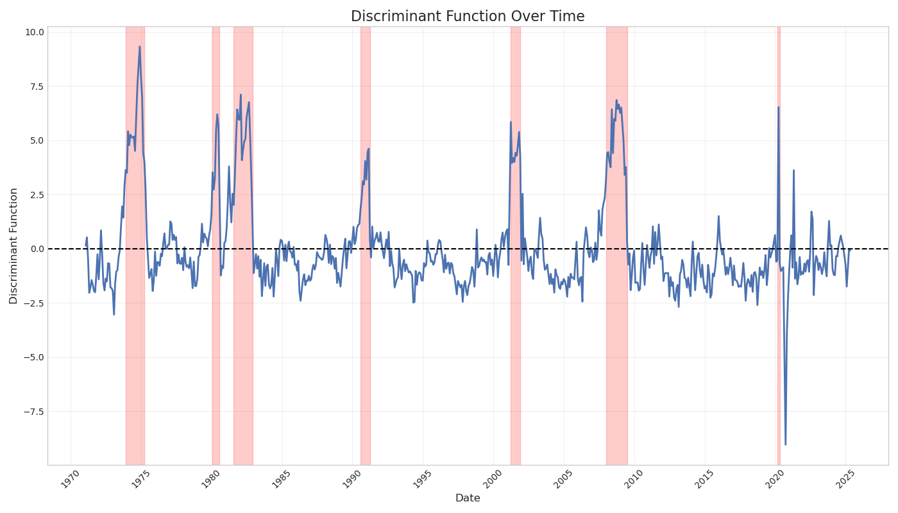

**Description**: This visualization shows the discriminant function values over time, with recession periods highlighted.

**Interpretation**:
- Values above zero indicate a higher probability of recession
- Values below zero indicate a lower probability of recession
- The discriminant function combines multiple indicators into a single value
- Transitions from negative to positive values often precede recessions

## Recession Periods Reference
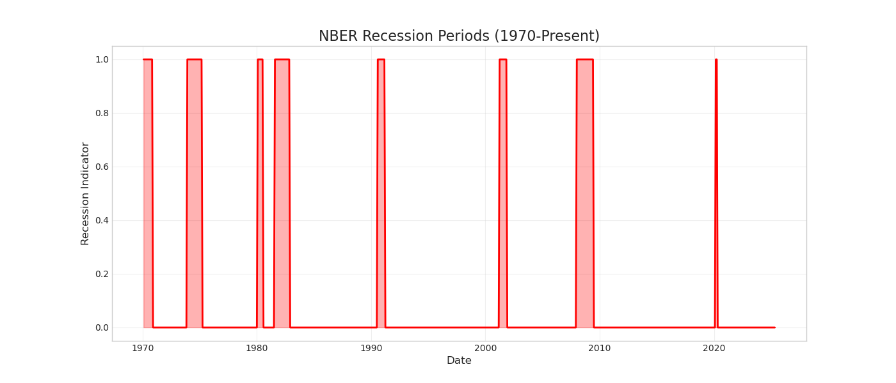

**Description**: This visualization shows the official recession periods as defined by the National Bureau of Economic Research (NBER).

**Interpretation**:
- Gray shaded areas represent official recession periods
- Used as the ground truth for training and evaluating the model
- Helps in understanding the historical context of economic downturns

## Data Timeframe

The visualizations in this project are based on economic data spanning from **January 1970 to April 2025**. This timeframe encompasses:

- 8 recession periods as defined by the National Bureau of Economic Research (NBER)
- Multiple economic cycles of expansion and contraction
- Various monetary policy regimes
- Major economic events including the 1970s oil crisis, early 1980s recession, dot-com bubble, 2008 financial crisis, and COVID-19 pandemic

The data includes:
- **Historical data**: Complete historical data from January 1970 to May 2024
- **Forward-looking data**: Some indicators extend into 2025, including:
  - Yield curve projections (extending to May 2025)
  - Unemployment rate forecasts (to April 2025)
  - Housing starts projections (to April 2025)
  - CPI forecasts (to April 2025)
  - Inflation expectations (to March 2025)

This combination of historical and forward-looking data allows for both retrospective analysis of past recessions and prospective assessment of future recession risks.

## Using These Visualizations

These visualizations can be used to:

1. **Understand historical patterns**: Identify how economic indicators behave before, during, and after recessions
2. **Evaluate model performance**: Assess how well the MDA model captures recession patterns
3. **Monitor current conditions**: Compare current economic indicators to historical patterns
4. **Identify leading indicators**: Determine which indicators provide early warnings of potential downturns
5. **Analyze sentiment impact**: Understand how consumer sentiment relates to economic conditions
6. **Historical context**: Place current economic conditions within the context of over five decades of economic data

For more detailed analysis, refer to the Jupyter notebooks in the `notebooks/` directory, which provide step-by-step explanations of the data analysis and modeling process.
